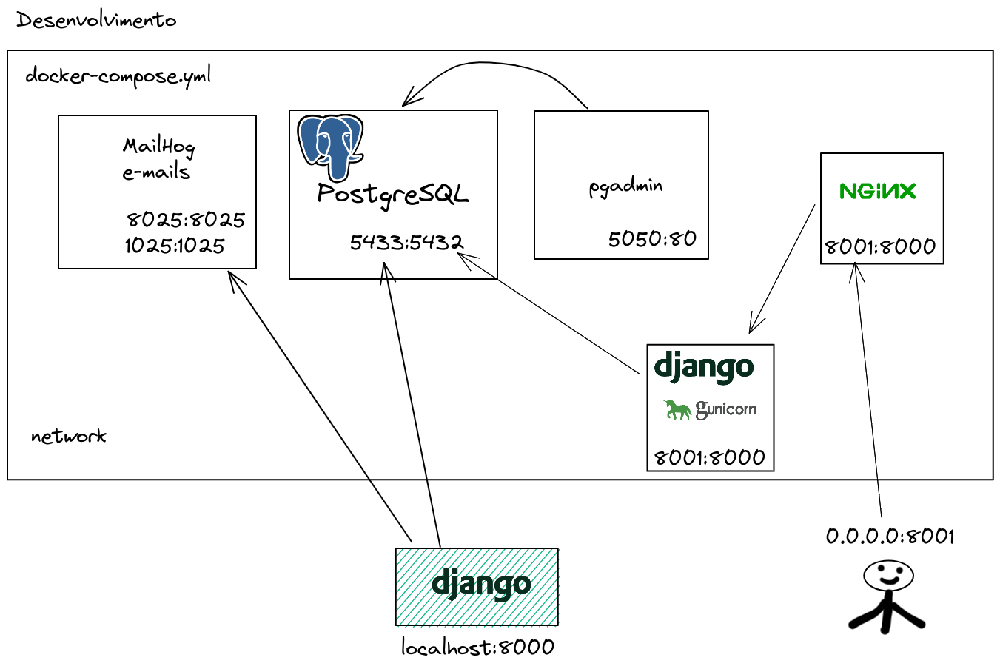
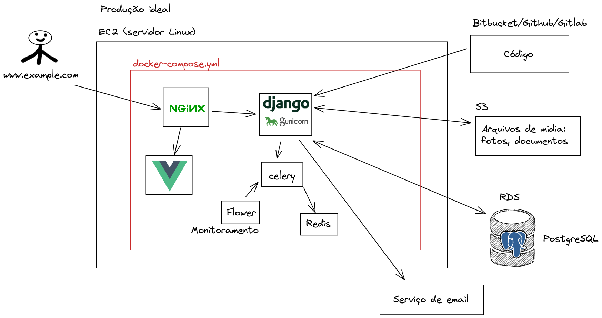

# Docker

O [Docker](https://docs.docker.com/get-docker/) é um programa que roda containers.

O [docker-compose](https://docs.docker.com/compose/install/) é um programa que roda vários containers em uma (ou várias) redes (network).

https://hub.docker.com/ é um site que contém as imagens oficiais de vários containers.

Assista este video

<a href="https://youtu.be/MeFyp4VnNx0">
    
</a>

> Faça suas anotações dos comandos.

> Tente você mesmo instalar o docker e o docker-compose.

Depois verifique se está instalado com

```
docker --version
docker-compose --version
```

### Mais videos

#### Introdução ao Docker com Gomex

<a href="https://youtu.be/lEPTR2AbRto">
    
</a>


#### Introdução ao Docker-compose com Gomex

<a href="https://youtu.be/CByr4db4shQ">
    
</a>


#### Dica #58 - Rodando PostgreSQL com Docker + Portainer + pgAdmin + Django local para desenvolvimento

<a href="https://youtu.be/aWZDFKJz7X8">
    
</a>


### Comandos básicos do Docker

https://gist.github.com/rg3915/01524053eecfaa52a32d9f5e00e01c44


## Portainer

O [Portainer](https://www.portainer.io/) é um serviço que serve para monitar nossos containers.

Para rodar o portainer na sua máquina digite

```
# Portainer
docker run -d \
--name myportainer \
-p 9000:9000 \
--restart always \
-v /var/run/docker.sock:/var/run/docker.sock \
-v /opt/portainer:/data \
portainer/portainer
```


## MailHog

[MailHog](https://github.com/mailhog/MailHog) é um serviço onde você pode receber e-mails de verdade simulando localmente na sua máquina.


Para rodar direto no terminal, digite

```
# MailHog
docker run -d -p 1025:1025 -p 8025:8025 mailhog/mailhog
```

... mas nós vamos rodá-lo no docker-compose.

https://akrabat.com/using-mailhog-via-docker-for-testing-email/


### Configurar settings.py

```python
EMAIL_BACKEND = 'django.core.mail.backends.smtp.EmailBackend'

DEFAULT_FROM_EMAIL = config('DEFAULT_FROM_EMAIL', 'webmaster@localhost')
EMAIL_HOST = config('EMAIL_HOST', '0.0.0.0')  # localhost
EMAIL_PORT = config('EMAIL_PORT', 1025, cast=int)
EMAIL_HOST_USER = config('EMAIL_HOST_USER', '')
EMAIL_HOST_PASSWORD = config('EMAIL_HOST_PASSWORD', '')
EMAIL_USE_TLS = config('EMAIL_USE_TLS', default=False, cast=bool)
```

## Montando vários containers com docker-compose


### Desenvolvimento

#### Django rodando localmente


#### Django rodando dentro do Docker




### Produção




### Desenvolvimento

Edite `settings.py`

```python
# settings.py

DATABASES = {
    'default': {
        'ENGINE': 'django.db.backends.postgresql',
        'NAME': config('POSTGRES_DB', 'db'),  # postgres
        'USER': config('POSTGRES_USER', 'postgres'),
        'PASSWORD': config('POSTGRES_PASSWORD', 'postgres'),
        # 'db' caso exista um serviço com esse nome.
        'HOST': config('DB_HOST', '127.0.0.1'),
        'PORT': '5433',  # <-- para desenvolvimento
        # 'PORT': '5432',  # <-- mude para 5432
    },
    'sqlite': {
        'ENGINE': 'django.db.backends.sqlite3',
        'NAME': BASE_DIR / 'db.sqlite3',
    },
}
```

Crie `docker-compose.yml`

```
version: "3.8"

services:
  database:
    container_name: db
    image: postgres:13.4-alpine
    restart: always
    user: postgres  # importante definir o usuário
    volumes:
      - pgdata:/var/lib/postgresql/data
    environment:
      - LC_ALL=C.UTF-8
      - POSTGRES_PASSWORD=postgres  # senha padrão
      - POSTGRES_USER=postgres  # usuário padrão
      - POSTGRES_DB=db  # necessário porque foi configurado assim no settings
    ports:
      - 5433:5432  # repare na porta externa 5433
    networks:
      - exams

  pgadmin:
    container_name: pgadmin
    image: dpage/pgadmin4
    restart: unless-stopped
    volumes:
       - pgadmin:/var/lib/pgadmin
    environment:
      PGADMIN_DEFAULT_EMAIL: admin@admin.com
      PGADMIN_DEFAULT_PASSWORD: admin
      PGADMIN_CONFIG_SERVER_MODE: 'False'
    ports:
      - 5050:80
    networks:
      - exams

  mailhog:
    image: mailhog/mailhog
    logging:
      driver: 'none'  # disable saving logs
    ports:
      - 1025:1025 # smtp server
      - 8025:8025 # web ui
    networks:
      - exams

volumes:
  pgdata:  # mesmo nome do volume externo definido na linha 10
  pgadmin:

networks:
  exams:
```

### Subindo os containers

```
docker-compose up -d
```

### Rodando o Django localmente

```
python -m venv .venv
source .venv/bin/activate
pip install -r requirements.txt
python manage.py migrate
```

```
django.core.exceptions.ImproperlyConfigured: Error loading psycopg2 module: No module named 'psycopg2'
```

```
pip install psycopg2-binary
pip freeze | grep psycopg2 >> requirements.txt
```

```
python manage.py migrate
python manage.py createsuperuser
```

### Lendo os dados do banco dentro do container

```
docker container exec -it db psql
\c db
\dt
SELECT email, user_type FROM accounts_user;
```

### Debugando localmente com ipdb

```
pip install ipdb
```

### Rodando o Django dentro de um container

Precisamos criar um `Dockerfile` para configurar a imagem do Django num container.

```
touch Dockerfile
```

```
FROM python:3.10-slim

ENV PYTHONUNBUFFERED 1
ENV DJANGO_ENV dev
ENV DOCKER_CONTAINER 1
RUN mkdir /app
WORKDIR /app
EXPOSE 8000

COPY requirements.txt .
COPY .env .
RUN pip install -U pip && pip install -r requirements.txt

COPY manage.py .
COPY backend backend

CMD python manage.py migrate --no-input
CMD python manage.py collectstatic --no-input
CMD gunicorn backend.wsgi:application -b 0.0.0.0:8000
```

#### Edite o docker-compose.yml

> Note que renomeamos a `networks` para `exams`.

A ordem é importante, coloque `database` primeiro, pra criar o banco, e só depois conectar.

```
services:
  database:
    container_name: db
    image: postgres:13.4-alpine
    restart: always
    user: postgres  # importante definir o usuário
    volumes:
      - pgdata:/var/lib/postgresql/data
    environment:
      - LC_ALL=C.UTF-8
      - POSTGRES_PASSWORD=postgres  # senha padrão
      - POSTGRES_USER=postgres  # usuário padrão
      - POSTGRES_DB=db  # necessário porque foi configurado assim no settings
    ports:
      - 5433:5432  # repare na porta externa 5433
    networks:
      - exams

  app:
    build:
      context: .
      dockerfile: Dockerfile
    container_name: app
    hostname: app
    stdin_open: true
    expose:
      - '8000'
    volumes:
      - .env:/app/.env
      - /tmp:/tmp
    command: bash -c "gunicorn backend.wsgi:application -b 0.0.0.0:8000"
    networks:
      - exams

  nginx:
    container_name: nginx
    image: nginx
    hostname: nginx
    ports:
      - '8000:8000'
    volumes:
      - ./config/nginx:/etc/nginx/conf.d
    depends_on:
      - app
    networks:
      - exams
```

Crie um arquivo chamado `config/nginx/app.conf`.

```
mkdir -p config/nginx
touch config/nginx/app.conf
```

```
# define group app
upstream app {
  # define server app
  server app:8000;
}

# server
server {
  listen 8000;
  charset utf-8;

  client_max_body_size 50M;

  # domain localhost
  server_name localhost;

  # Handle favicon.ico
  location = /favicon.ico {
    return 204;
    access_log off;
    log_not_found off;
  }

  # Django app
  location / {
    proxy_pass http://app;
    proxy_set_header X-Forwarded-For $proxy_add_x_forwarded_for;
    proxy_set_header Host $host;
    proxy_redirect off;
  }
}
```

Finalmente rode

```
docker-compose up --build -d
```

**Erro**

```
DisallowedHost at /
Invalid HTTP_HOST header: '0.0.0.0'. You may need to add '0.0.0.0' to ALLOWED_HOSTS.
```

Edite `settings.py`

```python
from decouple import Csv, config

DEBUG = config('DEBUG', default=False, cast=bool)

ALLOWED_HOSTS = config('ALLOWED_HOSTS', default=[], cast=Csv())

'PORT': '5432',
```

Edite `.env`

```
DB_HOST=db
```

Rode novamente

```
docker-compose up --build -d
```

#### Migrate

```
docker container exec app python manage.py migrate
```

#### Estáticos

Usando [WhiteNoise](http://whitenoise.evans.io/en/stable/)

```
pip install whitenoise
pip freeze | grep whitenoise >> requirements.txt
```

Edite `settings.py`

```python
MIDDLEWARE = [
    # ...
    "django.middleware.security.SecurityMiddleware",
    "whitenoise.middleware.WhiteNoiseMiddleware",
    # ...
]
```


```
docker container exec app python manage.py collectstatic
```


#### Create super user

```
docker container exec -it app bash
root@app:/app# python manage.py createsuperuser
```

#### Erro de csrf_token

Esse erro ocorreu no Django 4.0

https://www.reddit.com/r/django/comments/s6daj0/csrf_verification_failed_django_nginx_docker/

Então edite `settings.py`

```
CSRF_TRUSTED_ORIGINS = [
    'http://0.0.0.0:8000'
]
```

Tudo pronto!
