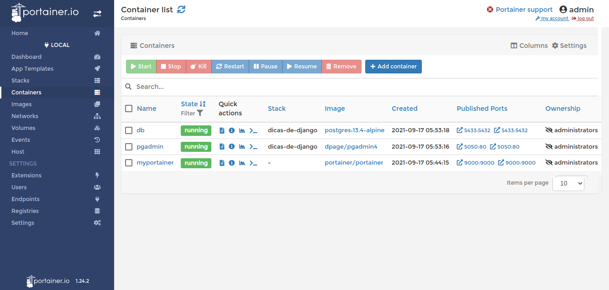
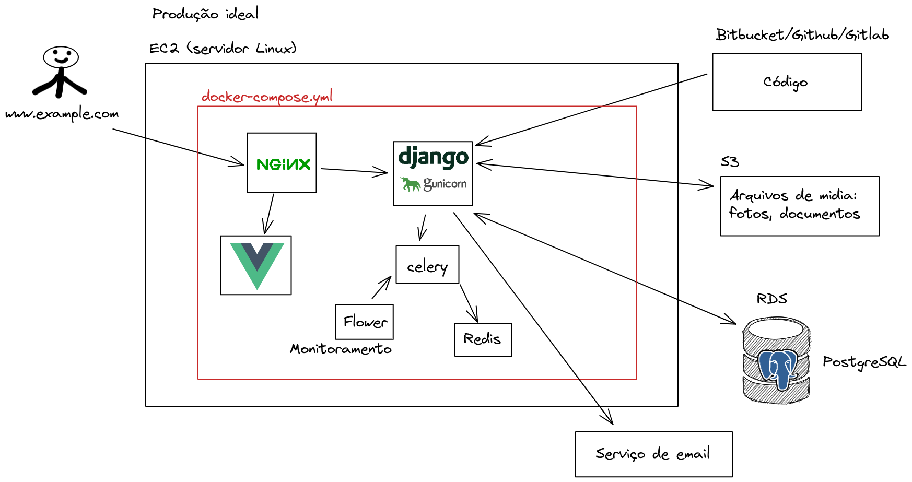

# Docker

O [Docker](https://docs.docker.com/get-docker/) é um programa que roda containers.

O [docker-compose](https://docs.docker.com/compose/install/) é um programa que roda vários containers em uma (ou várias) redes (network).

https://hub.docker.com/ é um site que contém as imagens oficiais de vários containers.

Assista este video

<a href="https://youtu.be/MeFyp4VnNx0">
    
</a>

> Faça suas anotações dos comandos.

> Tente você mesmo instalar o docker e o docker-compose.

Depois verifique se está instalado com

```
docker --version
docker-compose --version
```

### Mais videos

#### Introdução ao Docker com Gomex

<a href="https://youtu.be/lEPTR2AbRto">
    
</a>


#### Introdução ao Docker-compose com Gomex

<a href="https://youtu.be/CByr4db4shQ">
    
</a>


#### Dica #58 - Rodando PostgreSQL com Docker + Portainer + pgAdmin + Django local para desenvolvimento

<a href="https://youtu.be/aWZDFKJz7X8">
    
</a>


### Comandos básicos do Docker

https://gist.github.com/rg3915/01524053eecfaa52a32d9f5e00e01c44


## Portainer

O [Portainer](https://www.portainer.io/) é um serviço que serve para monitar nossos containers.

Para rodar o portainer na sua máquina digite

```
# Portainer
docker run -d \
--name myportainer \
-p 9000:9000 \
--restart always \
-v /var/run/docker.sock:/var/run/docker.sock \
-v /opt/portainer:/data \
portainer/portainer
```




## MailHog

[MailHog](https://github.com/mailhog/MailHog) é um serviço onde você pode receber e-mails de verdade simulando localmente na sua máquina.


Para rodar direto no terminal, digite

```
# MailHog
docker run -d -p 1025:1025 -p 8025:8025 mailhog/mailhog
```

... mas nós vamos rodá-lo no docker-compose.

https://akrabat.com/using-mailhog-via-docker-for-testing-email/


### Configurar settings.py

```python
EMAIL_BACKEND = 'django.core.mail.backends.smtp.EmailBackend'

DEFAULT_FROM_EMAIL = config('DEFAULT_FROM_EMAIL', 'webmaster@localhost')
EMAIL_HOST = config('EMAIL_HOST', '0.0.0.0')  # localhost
EMAIL_PORT = config('EMAIL_PORT', 1025, cast=int)
EMAIL_HOST_USER = config('EMAIL_HOST_USER', '')
EMAIL_HOST_PASSWORD = config('EMAIL_HOST_PASSWORD', '')
EMAIL_USE_TLS = config('EMAIL_USE_TLS', default=False, cast=bool)
```

## Montando vários containers com docker-compose


### Desenvolvimento


### Produção




